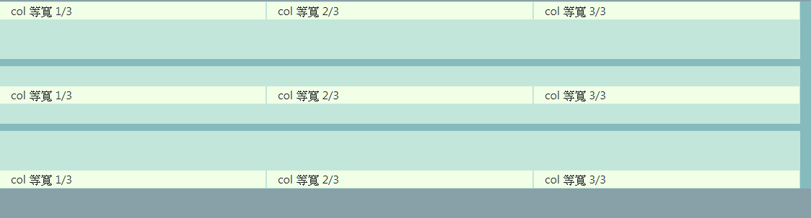
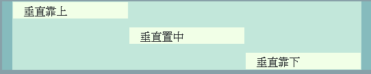
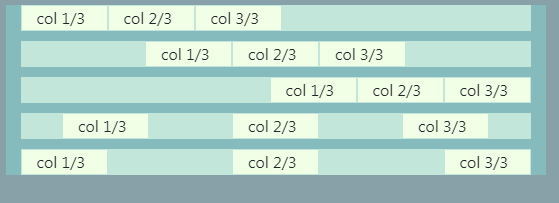

## 容器對齊方式

- 全部垂直對齊 : 將裡面的所有標籤或內容進行 上下位置 調整



- 個別垂直對齊 : 將自身標籤進行 上下位置 調整



- 水平對齊 : 將裡面的所有標籤或內容進行 左右位置 調整



| 對齊方式 | 位置 | 用法 |
| -- | -- | -- |
| 全部垂直靠上對齊 | outside | align-items-start |
| 全部垂直置中對齊 | outside | align-items-center |
| 全部垂直靠下對齊 | outside | align-items-end |
| 個別垂直靠上對齊 | inside | align-self-start |
| 個別垂直置中對齊 | inside | align-self-center |
| 個別垂直靠下對齊 | inside | align-self-end |
| 水平靠左對齊 | outside | justify-content-start |
| 水平置中對齊 | outside | justify-content-center |
| 水平靠右對齊 | outside | justify-content-end |
| 水平分散對齊(有左右間隔) | outside | justify-content-around |
| 水平分散對齊(無左右間隔) | outside | justify-content-between |

- 範例 : 
```html
<div class="container">
    <div class="row (outside)">
        <div class="col (inside)">col 等寬 1/3</div>
        <div class="col (inside)">col 等寬 2/3</div>
        <div class="col (inside)">col 等寬 3/3</div>
    </div>
</div>
```


