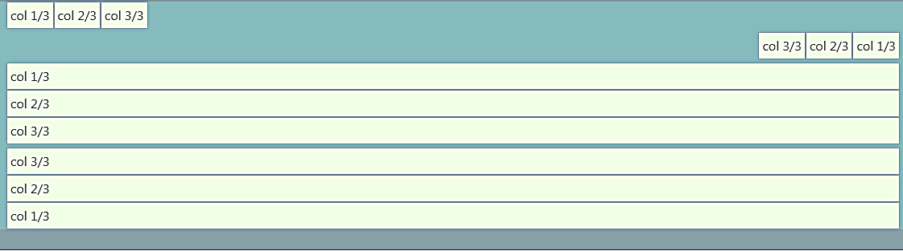

## Flexbox方向性

- 水平：.flex-row（預設值）
- 反向水平：.flex-row-reverse
- 垂直：.flex-column
- 反向垂直：.flex-column-reverse
- 範例：
- html：
```html
<div class="container">
    <div class="d-flex flex-row my-1">
        <div class="p-1">col 1/3</div>
        <div class="p-1">col 2/3</div>
        <div class="p-1">col 3/3</div>
    </div>
    <div class="d-flex flex-row-reverse my-1">
        <div class="p-1">col 1/3</div>
        <div class="p-1">col 2/3</div>
        <div class="p-1">col 3/3</div>
    </div>  
    <div class="d-flex flex-column my-1">
        <div class="p-1">col 1/3</div>
        <div class="p-1">col 2/3</div>
        <div class="p-1">col 3/3</div>
    </div>
    <div class="d-flex flex-column-reverse my-1">
        <div class="p-1">col 1/3</div>
        <div class="p-1">col 2/3</div>
        <div class="p-1">col 3/3</div>
    </div>
</div>
```
- css：
```css
body{
    background-color: #88a0a8;
}
div.container{
    background-color: #86bbbd;
}
div.row{
    background-color: #c2e7da;
}
div.p-1, div.col{
    background-color: #f1ffe7;
    border: 1px solid #88a0a8;
}
```


