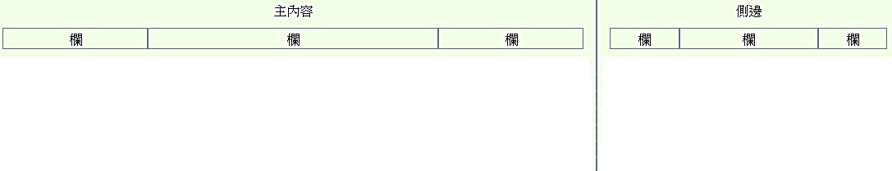

## 巢狀欄位

### 一、使用網格的注意事項
- .row 裡面還可以有 .row，子 .row 會以父 .row 的寬度為依據來進行寬度調整
- 使用範例：
- html:
```html
<div class="container">
  <div class="row">
    <div class="col-sm-8">
      主內容
      <div class="row">
        <div class="col-sm-3">欄</div>
        <div class="col-sm-6">欄</div>
        <div class="col-sm-3">欄</div>
      </div>
    </div>   
    <div class="col-sm-4">
      側邊
      <div class="row">
        <div class="col-sm-3">欄</div>
        <div class="col-sm-6">欄</div>
        <div class="col-sm-3">欄</div>
      </div>
    </div>
  </div>
</div>
```
- css:
```css
div.col-sm-8, div.col-sm-4, div.col-sm-3, div.col-sm-6{
    background-color: #f1ffe7;
    border:1px solid #88a0a8;
    text-align: center;
}
```

