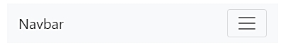
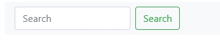

## 導覽列

- .navbar-expand{-sm|-md|-lg|-xl}  
  是指 {-sm|-md|-lg|-xl}  範圍以上才會直接展開選項
- .navbar-brand 專案名稱。
- .navbar-toggler 用於折疊插件和其他 navigation toggling 行為。
- .navbar-nav 提供導航（包括下拉清單）。
- .form-inline 任何表單控制元件和操作。
- .navbar-text 垂直居中的文本字串。
- .collapse.navbar-collapse 外層中斷點群組和隱藏導覽列內容。

#### .navbar-brand 製作自己的專案品牌
- 可放導覽或折疊插件下面,小型螢幕裝置會改變頁面配置
    - 可參考 : http://bootstrap.hexschool.com/docs/4.0/components/navbar/#toggler
- 範例 : 
```html
<nav class="navbar navbar-light bg-light">
  <a class="navbar-brand" href="#">
    
    Bootstrap
  </a>
</nav>
```

#### .navbar-toggler 用於折疊插件
- 配合下面的導覽而先介紹 .navbar-toggler
- 導覽列可以使用 .navbar-toggler、.navbar-collapse、.navbar-expand{-sm|-md|-lg|-xl} 來改變。
  結合其他通用類別，選擇顯示或隱藏特定元素。
- 不需要折疊的導覽列，在導覽列中加入 .navbar-expand。總是折疊的導覽列，不加任何 .navbar-expand 
- toggler 是為了讓導覽資訊在螢幕較小的裝置時變成下拉式選單的關鍵
- 可以看到下面範例,data-target指定要收縮div裡面的內容,所以id必須要一樣
- 範例 :



```html
<nav class="navbar navbar-expand-lg navbar-light bg-light">
  <a class="navbar-brand" href="#">Navbar</a>
  <button class="navbar-toggler" type="button" data-toggle="collapse" 
        data-target="#navbarSupportedContent" aria-controls="navbarSupportedContent" 
        aria-expanded="false" aria-label="Toggle navigation">
    <span class="navbar-toggler-icon"></span>
  </button>
  <div class="collapse navbar-collapse" id="navbarSupportedContent">
      <!-- 可將導覽放入 -->
  </div>
</nav>
```

#### .navbar-nav 導覽
- 導覽的連結建立在 .nav 選項上
- 在導覽列中的導覽元件，將佔用更多的水平空間，以保持導覽列內容安全對齊
-  用 .active 表示當前頁面。可用於 .nav-link 或 .nav-item
- 範例 : (兩者效果依樣)

```html
<!-- 範例 1 -->
<ul class="navbar-nav">
    <li class="nav-item active">
        <a class="nav-link" href="#">Home 
            <span class="sr-only">(current)</span>
        </a>
    </li>
    <li class="nav-item">
        <a class="nav-link" href="#">Features</a>
    </li>
    <li class="nav-item">
        <a class="nav-link" href="#">Pricing</a>
    </li>
    <li class="nav-item">
        <a class="nav-link disabled" href="#">Disabled</a>
    </li>
</ul>

<!-- 範例 2 -->
<div class="navbar-nav">
    <a class="nav-item nav-link active" href="#">Home 
        <span class="sr-only">(current)</span>
    </a>
    <a class="nav-item nav-link" href="#">Features</a>
    <a class="nav-item nav-link" href="#">Pricing</a>
    <a class="nav-item nav-link disabled" href="#">Disabled</a>
</div>
```

#### 下拉式選單 :　請確保 .nav-item 和 .nav-link 使用單獨及巢狀的元素
- 範例 :
```html
<li class="nav-item dropdown">
    <a class="nav-link dropdown-toggle" href="#" id="navbarDropdownMenuLink" 
        data-toggle="dropdown" aria-haspopup="true" aria-expanded="false">
        Dropdown link
    </a>
    <div class="dropdown-menu" aria-labelledby="navbarDropdownMenuLink">
        <a class="dropdown-item" href="#">Action</a>
        <a class="dropdown-item" href="#">Another action</a>
        <a class="dropdown-item" href="#">Something else here</a>
    </div>
</li>
```

#### 表單
- 在導覽列中放置各種表單控制元件，這是透過 .form-inline 水平放置的表單
- 範例 :



```html
<nav class="navbar navbar-light bg-light">
  <form class="form-inline">
    <input class="form-control mr-sm-2" type="search" placeholder="Search" aria-label="Search">
    <button class="btn btn-outline-success my-2 my-sm-0" type="submit">Search</button>
  </form>
</nav>
```
- 根據需要將行內表單的內容透過通用類別對齊。(可參考 : 容器對齊方式)
```html
<!-- justify-content-between : 水平分散對齊(無左右間隔) -->
<nav class="navbar navbar-light bg-light justify-content-between">
  <!-- 裡面內容會自動對齊 -->
</nav>
```

#### 文字
- 導覽列可在 .navbar-text 包含一些文本。 class 會調整文本字串的垂直對齊和水平間距
- 範例 :
```html
<nav class="navbar navbar-light bg-light">
  <span class="navbar-text">
    Navbar text with an inline element
  </span>
</nav>
```

#### 顏色方案
- .navbar-light 選淺色背景顏色，或者 .navbar-dark 用深色背景顏色
- 更多顏色 : 
    - https://work.smarchal.com/twbscolor/css/e74c3cc0392becf0f1ffbbbc0
    - https://stackoverflow.com/questions/18529274/change-navbar-color-in-twitter-bootstrap
- 範例 : 

```html
<nav class="navbar navbar-dark bg-dark">
  <!-- Navbar content -->
</nav>

<nav class="navbar navbar-dark bg-primary">
  <!-- Navbar content -->
</nav>

<nav class="navbar navbar-light" style="background-color: #e3f2fd;">
  <!-- Navbar content -->
</nav>
```

#### 容器
- 可將導覽列包裹在 .container 中，放置在頁面中央或內容的中間 固定或靜態於頂的導覽列 位置
- 範例 : 

```html
<div class="container">
  <nav class="navbar navbar-expand-lg navbar-light bg-light">
    <a class="navbar-brand" href="#">Navbar</a>
  </nav>
</div>
```
- .container 在導覽列中，其水平 padding 在低於指定的 .navbar-expand{-sm|-md|-lg|-xl} 中斷點處被移除
  這確保了當您的導覽列折疊時，不會產生多餘的 padding
- 範例 : 

```html
<nav class="navbar navbar-expand-lg navbar-light bg-light">
  <div class="container">
    <a class="navbar-brand" href="#">Navbar</a>
  </div>
</nav>
```

#### 定位
- 預設 : 

```html
<nav class="navbar navbar-light bg-light">
  <a class="navbar-brand" href="#">Default</a>
</nav>
```
- 固定在上方(相對位置)

```html
<nav class="navbar fixed-top navbar-light bg-light">
  <a class="navbar-brand" href="#">Fixed top</a>
</nav>
```
- 固定在下方(相對位置)

```html
<nav class="navbar fixed-bottom navbar-light bg-light">
  <a class="navbar-brand" href="#">Fixed top</a>
</nav>
```
